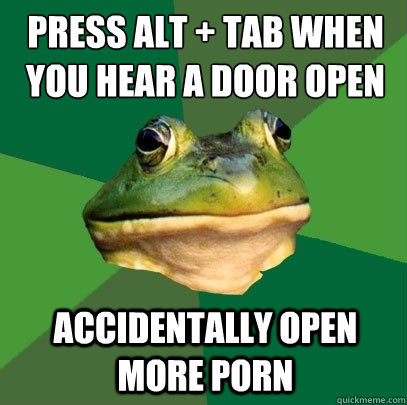
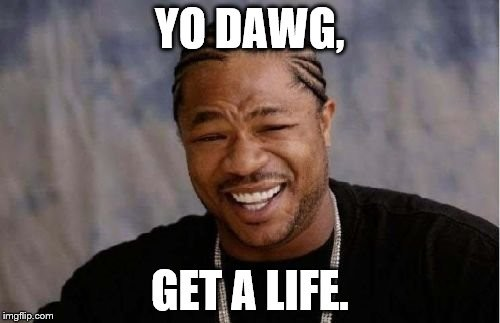

Recently interesting coincidence has happened. I lost two domains at the same time. What happened to each of them turned out to be completely different. So much, that it gave me a great study of conflict resolution and stress management.

In both cases beginning was similar. I owned domain. I had a hectic year. I forgot to pay. I lost. I visited them and then...

## First - brand

Lose of my personal brand built since childhood did hurt. I did not use it recently. I moved to perm position and left my own ventures aside. Still. That was one word I built over almost two decades. When I notice Korean porn site using this name I almost fainted. I literally spammed everyone who could help me. Original site owners, the person who registered the domain, registrar and even Chinese Embassy as it was registered there (and porn seems to be illegal in that country too).

Two weeks of silence and then I start getting emails. First difficult as sender didn't want to use English and typed responses in the subject field (so I missed them). Fast it turned to be very fair, honest and truthful guy, who offered to sell the domain back. For GBP20 (a bargain). Helped with the transfer, translated difficult manuals on Chinese registrar site. Even ensured I don't send money twice when we had some minor issue with banks.

I got it back. Not using still, but back.

## Second - name

Other domain I never really used. It was my first and last name. As I used my nickname as my brand I had no idea how to facilitate it. To be honest I never even name myself without using the middle name and if you google without it you'd find more doctors and soldiers than my profiles.

When I visited it, it turned out to be pointing to the company website of the guy who we released ages ago from one of the startups I had a leading role at. That wasn't the first time some funky movement came from his side and did not really surprised me. Especially almost at the same time, he published another annual article on his abandoned blog about how bad we were and how we failed as a startup.

Professionalism, ethics, law and even common sense don't let me dig into details what and why happened. I won't even name the person (even I know he'd read it and adore the fact that finally he was openly mentioned). I believe anyone deserves clean start and another chance. So there is no interest in pulling him lower. In the end, he grabbed domain with the wrong Lukasz Sielski for the god's sake (remember about the middle name?).

As so far over the years I can just smile, then hope it won't last long as it's worrying when someone who was partly your responsibility doesn't manage to deal with rejection.

## Lessons learned

From Chinese domain squatter I come with very interesting observation, that no matter how we perceive someone's profession, we can't judge the person by it. In the end, we all are human and clean, a sensible discussion can reach good and rewarding resolutions.

From ex-colleague case, I come with the worrying observation that not always we can expect others to behave within social norms. But that doesn't mean we have to get affected or even reply with negativity. We shouldn't. Instead, it's wise and healthy to move away, focus on own goals and hope another party would do the same. We could be tempted to feel satisfaction that we did the right removal, as such activity proves incompatibility with the professional ecosystem (not saying about the fact that pointing third party personal name to own brand damages that brand in the first place), but it's not worth celebrating. Deducting team members always is a difficult task, hardly ever emotionless, every time biased and carries some risks. Same as keeping unhappy or unproductive setup.

The last lesson learned is that to look after own bloody IPs whatever they are trademarks (TMs or just LTD names, as such, are also protected), domains, names, patents, logotypes, etc.. It's very expensive (in terms of effort, emotions and sometimes money) to fix losing them.
