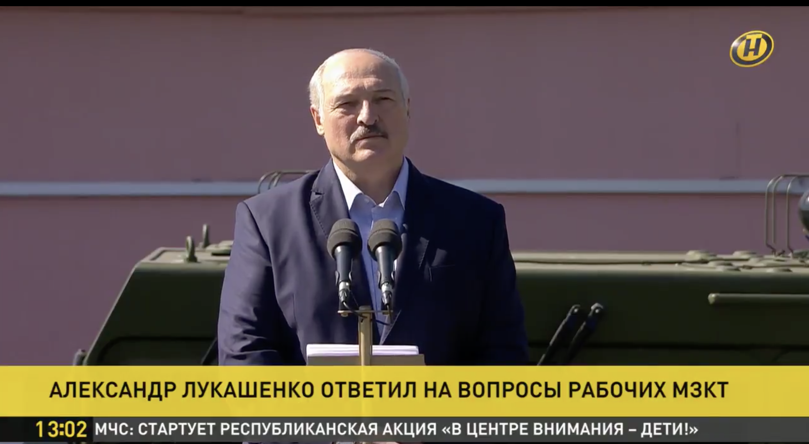

I continue my series reviewing press take on events in Belarus. I aim to determine the most reliable sources and call out any fakes, unfair judgements, stereotypes or sometimes even lies. Belarus at the moment receives carte blanche in public opinion, so their image mustn't be skewed by bad reporting.

I use [Newzit](https://www.newzit.com/?q=belarus) to track the lastest growing stories and focus on those from UK outlets.

In [Telegraph James Nixey](https://www.telegraph.co.uk/news/2020/08/17/rumblings-revolution-belarus-should-worry-vladimir-putin/) enters quite sensible debate on the Putin intentions and worries around the events in Belarus. I don't think the scenario was written there is the only one and we need to expect Russian invasion. The only sentence that should be corrected has the answer to that: "The Belarussian people are not anti-Russian". First of all, spelling Belarussian with double "s" is the offensive form that insists Belarus "is part of Russia". Nixey doesn't repeat that mistake further and writes the correct form: Belarusian. Also, this sentence doesn't reflect the whole picture. Belarus is not only not anti-Rusian. People of Belarus did not suffer Holodomor like Ukrainians. They don't have rooted hate to USSR. They feel the pride of being a "hero" nation who defeated fascism, but despite losing a quarter of their population during the WW2 they don't have martyr syndrome as Poland does. Belarus also, unlike Ukraine has a relatively small Russian minority, so see them more as close relatives, than "occupants". Last, but not least important, none of the main opponents to Lukashenko is anti-Russian. Each of them underlines that country needs to keep good relations with Russia and keep a healthy balance between West and East. In my opinion, Putin will gain more by lobbying to the new government than defending already finished Lukashenko.

In another article in [Telegraph Natalia Vasilyeva](https://www.telegraph.co.uk/news/2020/08/17/belarus-protesters-hold-historic-rally-challenger-disputed-election/) proves her place in the reporting elite and the benefit of being in the centre of the events. In her detail-rich narrative, she delivers not only emotions of the moment but draws a full picture of the situation. I only regret that when mentioning that the UK finally responded to the situation and called presidential election in Belarus void, she did not mention it took Dominic Raab over a week to react.

Speaking of that. In [Daily Mail Jack Maidment](https://www.dailymail.co.uk/news/article-8635007/Dominic-Raab-slams-fraudulent-Belarus-presidential-election.html) seems to be defending clueless Raab by adding strong statements like "slams" to describe very bleak and sluggish message from Foreign Office. The done is very apologetic and there is no mention of the delay. Plus Maidment says that EU reacted three days ago, when actually High Representative published a message on the 11th, so 6 days ago. The rest of the article is very brief and mention on Russian support again is added without very important condition: in case of external threat. Yes. Putin really is not going there yet.

In another article [Tim Stickings](https://www.dailymail.co.uk/news/article-8634819/Belaruss-opposition-leader-taking-dictator-Europe.html) takes on explaining Tsikhanouskaya story and because lovely hyperbole with comparing her to Joanne de Arc I can forgive starting with "stay-at-home mother". Her CV is a bit better than that. She's not only a teacher but an interpreter and human rights activist. It just happens she's on maternity leave, so let's not downplay her, please. The rest of the article is pretty ok and explains the person to people who did not pay attention to her story too well. It adds a bit of typical for Mail drama and bling but combined with very good pictures it makes the whole piece very likeable and pays some fairness to Svetlana.

Independent bit by [Jon Stone](https://www.independent.co.uk/news/uk/politics/belarus-election-result-2020-protest-uk-lukashenko-dominic-raab-latest-a9673596.html) focuses on today's message from Raab. It's mostly a list of facts, without any visible mistakes. Except for the previously mentioned delay.

Metro in their brief work by [Brodie Owen](https://metro.co.uk/2020/08/17/belarus-president-says-there-will-no-new-election-kill-13140049/) don't repeat yesterday mistakes and delivers quite a good set of information. They chose rightly [Franak Viačorka](https://twitter.com/franakviacorka) and [Tadeusz Giczan](https://twitter.com/TadeuszGiczan) as the source.

In [Evening Standard Kit Heren](https://www.standard.co.uk/news/world/belarus-elections-president-lukashenko-ready-hand-over-power-a4526976.html) takes unique take and focuses on new decoy made by Lukashenko by promising new election after a change to the constitution. He also mentions Raab and also no word of the delay.

When comes to the Guardian we are flooded by reports today with two from [Shaun Walker](https://www.theguardian.com/world/2020/aug/17/belarus-media-strike-if-we-cant-do-honest-journalism-we-wont-work) from Minsk with help of [Andrew Roth](https://www.theguardian.com/world/2020/aug/17/belarus-opposition-calls-for-general-strike-after-biggest-protests-yet) on one of them. Both articles are loaded with details, but less emotional or analytics than Telegraph ones. It's old good fact reporting. [Jennifers Rankin](https://www.theguardian.com/world/2020/aug/17/eu-calls-leaders-to-emergency-summit-to-support-belarus-people) piece describes the political position of all game players on the world scene with the same fact-fact-fact approach. Only thing I can mention is the same as in all examples above delay in Raab decision was not mentioned.

Editorial opinion to the events in [Guardian](https://www.theguardian.com/commentisfree/2020/aug/17/the-guardian-view-on-belarus-the-perilous-road-to-democracy) is another nice read, but I'll let you judge it by yourself.