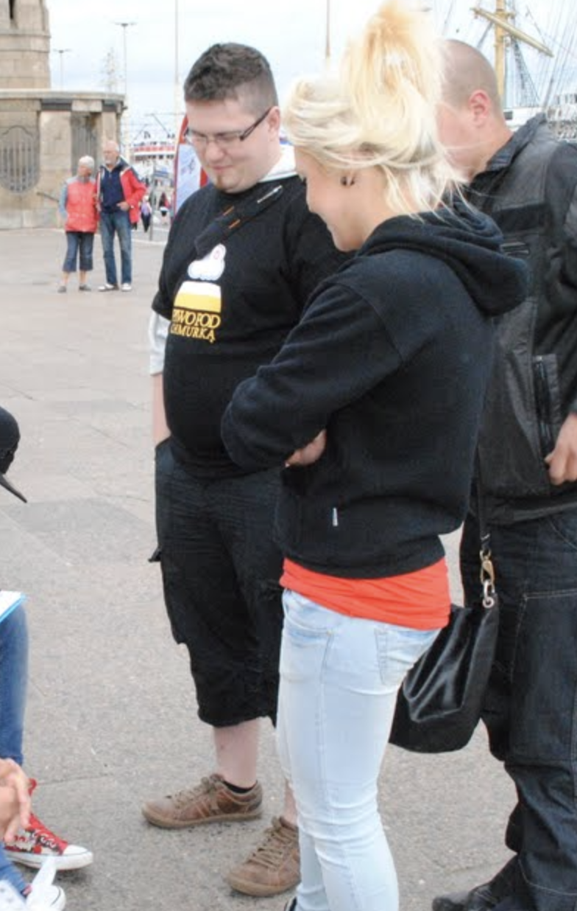
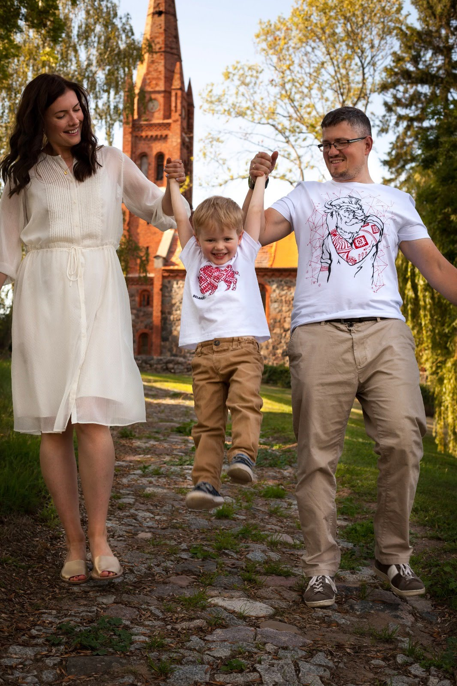

What I write here may sound bad for some people, even offend them. I understand and tolerate movement towards "body positivity". Anyhow, I also see the dark side of it. Body positivity often hides or even promotes a lifestyle that leads to disability and premature death. As a person who lost very early a parent to an unhealthy lifestyle, please allow me to oppose that movement. I respect it but consider wrong and harmful.

My weight fluctuation from 2011 to 2020

I won't hide it. With 33% body fat, clinically I'm obese. Still, after seven years logged fight with it. It would be far more, maybe even thirty years, if I counted non-cautious approaches to the issue. Back in 2011, I weighted just above 100 kilograms, and today I'm just below 100. At some point in 2012-2013, I was almost 120 (too ashamed to log it, so it's not on the graph). But I learned the weight or BMI aren't valid measures and understand that today 64 kilograms of lean muscle mass is much better than what I had at the beginning of my journey (wish I had it logged). I see the difference in the photos when I compare my past 100 and the current 100.

104kG in 2011

I'm still on my journey, and I don't think it will ever end. Mostly because now I understand the sources of my issue. Like alcoholic remains an alcoholic decades after last drink, same I will still be mentally obese when I achieve a lean body.

I learned anyhow what worked, what did not, what triggered things getting worse and why. Also, I understood there is no one rule that is good for everyone. For example, I know people who gained amazing effects cutting carbs away, but I know such an approach doesn't work for me and can even damage my results.

104kG in 2011

# What caused my obesity?

 - Stress is the biggest trigger. Sorting out it by changing the environment, removing unhealthy relations, establishing routines and planning is a must for me. Stress causes cravings and leads to snacking. If the food wasn't the escape, alcohol or tobacco could be.
 - Sleep deprivation. It's linked to the stress, but it's not always correlated. There are loads of good sources explaining it, like [Why we sleep by Matthew Walker](https://www.amazon.co.uk/Why-We-Sleep-Science-Dreams/dp/0141983760). It mostly leads to wrong food choices and snacking.
 - Bad habits regard portions taken from the family. Very common among all relatives, who were moved too rapidly from communistic poverty to relative wealth. Cannot recollect specific documentary, but [BBC many times mentioned that portion sizes have massively increased in the last decades](https://www.bbc.co.uk/news/uk-scotland-glasgow-west-45110151).
 - Bad habits regard the frequency and choice of meals. Our families, often because of the strong arm of food companies, forced us to think that we will die without 3 to 5 meals a day (eat your veg five times a day!) and that for example, cereals are the healthiest breakfast (though, data shows that they have a low fullness index and lead to cravings).

93kG in 2019

# What did not work?

 - Cut something out diets. I'm a "foodie". I like to taste new things. I love to cook. I learned to listen to my body. It knows the best what I need. But I also learned to plan to avoid an excessive amount of dangerous foods.
 - Counting calories. It is important. It's very important. But. It's impractical. I found fasting is a better tool for me here.
 - Too much cardio. Of course, daily sixteen miles trips by bike to the office helped me keep a calorie deficit. But also, it caused cravings for carbs. Once the lockdown limited my milage, that has damaged my results as well.
 - Short, intermittent fasting (below 24h). It is just too easy to exceed 2000 KCal, even doing OMAD (One Meal a Day).
 - One-off challenges. I lost almost 20 kG in 3 months in 2013, only to regain much of it shortly after. That is a marathon, not a sprint.

101kG in 2020

# What worked?

 - Weight training. Compared to nine years ago, I have stronger arms and shoulders, less fat hips and wider chest. My body composition has changed a lot. If I gain fat it's mostly on the belly, which proves better hormone management. I can do workout less often, but I have longer-lasting effects.
 - More vegetables and protein in my diet. I feel full much earlier and for longer. I crave less. I end up having fewer snacks afterwards. I'm healthier and less drowsy.
 - Longer fasting. Helps me focus. I'm far more productive at work on days without food. I tend to eat less in days following the fast. I know it helps my [pancreas to recover](https://www.nhs.uk/news/diabetes/fasting-diet-may-help-regenerate-a-diabetic-pancreas/). It's important as my father died of pancreatic cancer.
 - Stress management and planning. Getting organised and more relaxed helps me in many ways. But mainly prevents me from killing stress with food.

# What's next?

I will continue using the tools I learned to be most productive for me. I have some short term goals, but I know I need to be careful for the rest of my life. I do that not for myself, but for my children. Many would say that it should be the other way around. But I don't agree. I lost a parent when I entered adulthood and know what damage it caused. I want to be for them as long as possible. For that, I need to stay healthy. For that, I keep my fight with my obesity.

And what is your story? Do some of my tools work for you too?