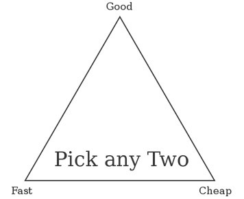

In response to one of my previous articles about prices in IT outsourcing I have been attacked that I lower employers expectations. It turned up from simple misunderstanding, because I was writing then about not too experienced developers (2-3 years) hired for full time and my arguer was freelance senior. I could agree with most of his points, but as someone who worked both as developer and manager, and have quite good understanding of economics, I would like to explain you what often we don’t take in account when we build (both employers and employees) our price expectations.

## 1. Average is a liar

When you discuss about prices you talk about majority. You have to be aware that most of technical role salaries don’t have representative average values. Why? Because they grow very fast in first 1-2 years and then are static to some point when they fire in the sky and grow without limits. There are reasons for it of course. Similar like in scrum voting we should cut off marginal values. Taking median or average of second and third quartile we get most reliable data. In general that means that you can’t take any valuations for granted.

Average can lie in other element too. You have to remember that most of your contractors will be sole traders. But not all of them. Some will be represented by LTD. Sometimes (in case of branch) you will consider simple employment. That determines price. Work costs in Poland are extremely high. Above 1000 EUR it’s not worth to be employed, but some people will take that cost to feel safer about their retirement.

Comparing data with non-EU or UK offers also needs attention. If you outsource work from EU state different than your own, you pay 0% VAT on top of them. That means your contractor benefits for working for you more, than by working locally.

## 2. Outsource is neither there and neither here

This point makes most of controversy. UK company while hiring someone remote WILL look for cost saving. If for the same price, they could get someone who is relatively cheap here, they wouldn’t even try to find outsourcing. On the other hand remote worker WILL look for better salary than in his place. Otherwise he wouldn’t spend time searching offshore clients. Let’s take a try. On reeds.co.uk I made a search for PHP developer positions within 10 miles from centre of London (so high prices). It gave me following results:

 * 15,000 GBP/annum – 29
 * 15,000 – 20,000 GBP/annum – 47
 * 20,000 – 30,000 GBP/annum – 160
 * 30,000 – 50,000 GBP/annum – 284
 * 50,000 GBP + – 170

That gives median on level of 30,000 – 50,000 with tendency to be closer to 30,000. Extending to radius 50 miles didn’t really made big change. That means that for very good, experienced, self-sustainable and self-organised developer UK company will be looking for not more than 15-30K per annum, what gives 11 EUR – 18 EUR per hour. Otherwise cost of managing offshore resource would be simply too big and won’t match the balance. Is that a rule? No. Especially free lance, per-project, short jobs are one the level o 100, 200, 300 GBP per day. Yes, it happens. But competition is high and requirements are even higher.

In the same time, if I compare prices advertised recently on local Polish forums I see that salaries hardly beat level of 10,000 PLN / mth, which is equivalent of 14 EUR / hour. If you compare that it’s not a big difference from employer point of view. Anyhow there are things that employer may take in account:

 * Side costs like taxes, are much higher in Poland. You can find better deal, if employer helps Polish contractor to register his sole-trader-ship in the UK
 * When by taking average (still good) workers we can expect better prices than in UK, if you consider real diamonds drop that argument. Poles are winning worldwide coding contests. For best you won’t compete with small local companies, but with Google, Microsoft and NASA.

## 3. Risk costs

There is huge difference between long and short term contract. No matter what kind of agreement you both have. If you hire some one for full time, with 2-3 month notice period you can lower expectations. If you hire someone to make some project, expect even twice more. Why? Because the risks. Someone who is ad-hoc freelancer is not anymore an employee. He is an agency. Agency have a lot of other costs, but give you flexibility. You pay for it, but it’s worth sometimes.

 * Agency/Freelancer takes more responsibility for the result.
 * Agency/Freelancer solves for you management and design loads.
 * Agency/Freelancer works no-time-limit for you. There are no 8 hour work day, there is deadline.
 * Agency/Freelancer costs more to find you and to find another deal. Employee is safer. That safety is what you save on the price.

## 4. Some things are priceless

Remember me saying about marginal values. That’s where it comes from. If you want extraordinary person, with good networking, not-like-an-agency ownership and dedication, narrow specialisation, big demand (you can compete for some), then expect higher prices. Most of high skilled workers feel bad, when median/average salary values are being published. But the reality is that, if you want to make things done best you are ready to spend more, like on triangle below:

## 5. Commitment and responsibility costs

One of the biggest mentality differences between Poland in UK is attitude. Good workers from Poland are dedicated, have wide knowledge and want to help you find solutions. Many workers from Western Europe are corporation creatures just executing orders. But there is a price. You have to take in your calculation, that this commitment will cost. Otherwise you will have just an agency, that does what you ask and not think if that has any sense.

## and 6th

Hiring single person full time is just beginning. Still you have to sort our how you will cooperate. If you hire more experienced (more expensive freelancer) issue will be solved automatically. But often you will have to find about side costs like for finding candidates, travels, project management, documentation, etc. If you need some tips in that area feel free to ask or contactHire Poles consultants.
