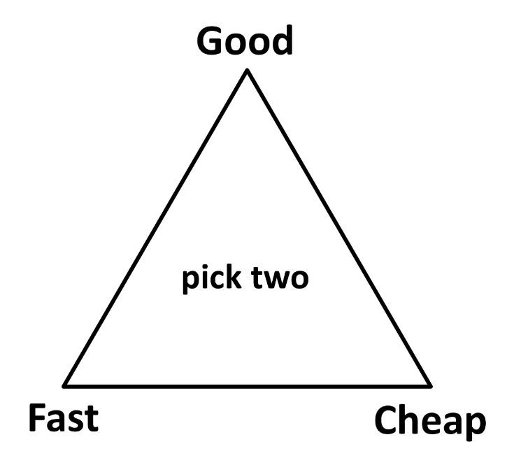
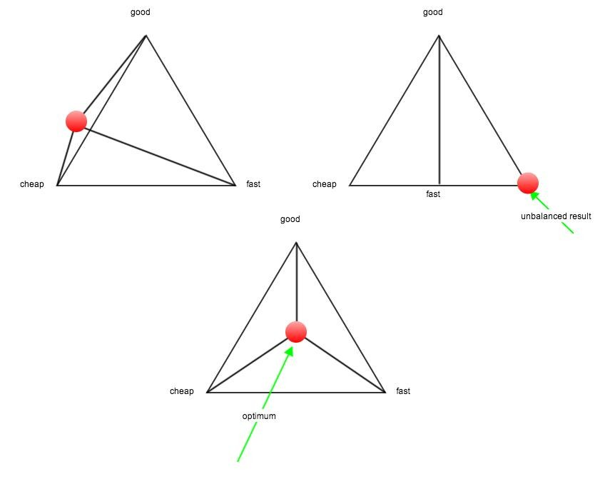

Let's take a look on estimation with a bit of humour.

All of us know image below. It is often chosen by Project Managers to determine team strategy and explain possible decision to the business. To remind image explain that you can have:

 * good and fast result, but not cheap (as fast for business are seconds, it's hardly possible still)
 * good and cheap, but won't be fast (good often isn't cheap anyhow)
 * cheap and fast, but it will be a crap.
 * something in the middle (optimum)

When you try to show that to the business often answer is that they need FAST, CHEAP and GOOD at once. It's a pattern and everlasting conflict between production and executives in modern companies.

But we can use geometry to verify that requirement. If you choose both fast, cheap and good, all on their extremum and connect that in the line, you will end up with a triangular pyramid! If you look on that from a side what you see?

No matter how you turn it around still you will be in the same situation. When your status will be same close to each three extremums it will never be cheap, good or fast.

But! Remember. According to many GEOMETRY is something that we can push off by simple:

> Let's ignore it

like in this video:

https://www.youtube.com/watch?v=BKorP55Aqvg
