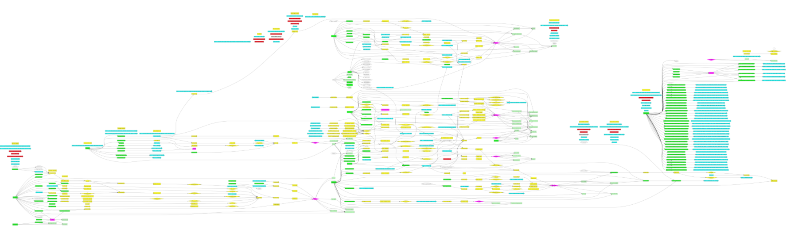

**TLDR** Documenting massive redux models with asynchronous actions can be simplified by using old good Graphviz and few comments in the code.

Skip the story - [actual use case](#actual-use-case).

## The story

Recently we have undergone quite a serious upgrade of our project. I faced quite a difficult task as under hefty time pressure we had to shred our app size (to be mobile friendly) and speed it up, but without compromise on maintainability.

We knew we have to say goodbye to old good Angular 2 (half way migrating it to 4) as it’s quite chunky and made with SPAs in mind. I did not want to drop into the trap of single framework, but really hated the idea of losing unified data model either.

That’s how our [TypedDocker](https://github.com/Pushfor/typeddocker) came to life. Fast baked set of various, light stacks that can easily be composed into full-stack, multi-head javascript project, easy to ship as a set of Docker containers. That solved the problem of being bound to one solution but did not address shareability of the model layer.

TypedDocker also it a good material for another article in the future.

We started parallel development of UI using TypedDocker and model that was totally cut out of it, easy to use with any framework and portable. We went for Redux as introducing a single point of truth was very tempting and promised small memory footprint and good performance. We were aware our logic is quite complex so for asynchronous events and action transformations we have chosen [React-Observable](https://github.com/redux-observable/redux-observable). It was not only easy migration as Angular use [RxJS](http://reactivex.io/rxjs/), but also an improvement in readability of the code (ok, observables may be difficult, but personally I prefer them more than generators used by [React-Saga](https://github.com/redux-saga/redux-saga)).

One thing we weren’t prepared for was the scale. Very easily we ended up with almost a 100 various actions, over 10 reducers, dozens of supported API endpoints, React-Observable epics. Wrapping that in testable and user-friendly SDK made it even scarier.

We sat and thought how we can organise this (what turned to be massive callback- or function-chain) hell. All sort of docs we used like JSdoc were good for describing interfaces, but not flows. We needed something very visual, but easy to use in the unstyled text. Like MarkDown for processes.

Quite easily our minds went to dot (or Graphviz). But manually creating it was no-go. Funny enough not long before I had a discussion with very senior VP of engineering in other company (who turned to be JavaScript guru as well) and he was quite surprised by the ease how I use regular expressions. It gave me a lightbulb moment, that few nice matches could allow easily inserting dot notation into JsDoc and producing flow diagrams. At the same time, they can be very readable just as a text.

That’s how [dot2doc](https://github.com/sielay/doc2dot) has been created.

## Actual use case

Let me show you an example. This is real life code snippet (as you can debug frontend JavaScript I am not afraid of sharing this one). It allowed me to define a class of the function in the chart (over here an Epic). Then I described that it’s being triggered (or as it’s epic it processes) action of type SEND_COMMENT and produce action actionCommentsData (we use consts for action names, and factory functions for creating actions with payload so we can enforce payload types and structure).

    /**
     * 
     * @param {Observable<AnyAction>} actions$ 
     * @dot {Epic} parcelCommentUISendCommentEpic
     * @dot SEND_COMMENT -> parcelCommentUISendCommentEpic -> actionCommentsData
     */

As a result that creates chart similar to this.

## Summary

What are benefits?

-   Function/method interaction is documented in it allowing easy code navigation
-   Visual graphs allow easily detect orphans, dead branches or infinite loops (and it’s possible to write software detecting them)
-   Flow documenting can become part of Definition of Done without big impact on workload

What are the downfalls?

-   My code could be better and actually extend JsDoc, now it’s just funky regexp
-   I have been proven to be wrong. It turns out that self-documenting code is a bit of a myth

How can you use it?

Just check the [README](https://github.com/sielay/doc2dot).
