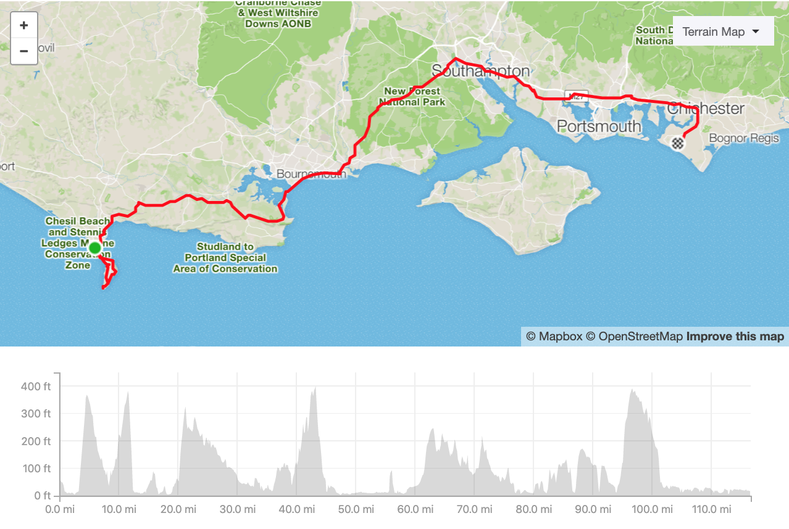

 * [What and why](#what-and-why)
 * [Preparations](#preparations)
 * [Departure](#departure)
 * [Training and diet](#training-and-diet)
 * [Day 1](#day-1)
 * [Day 2](#day-2)
 * [Day 3](#day-3)
 * [Day 4](#day-4)
 * [Day 5](#day-5)
 * [Recovery](#recovery)
 * [Back to the office](#back-to-the-office)
 * [Costs](#costs)

## What and why?

Another year, another challenge. After cycling 300 miles for University or Liverpool
Pancreatic Cancer Research Fund in 2017 and walking over 50 miles for 11-year-old
Szymon in 2018 I continue my journey by cycling 600 miles from Cornwall to Kent
(and back to London).

While doing it I'll be [fundraising](https://www.justgiving.com/fundraising/cornwalltokent)
for my local hospital children care units. The whole trip will be documented on
Instagram and here. This article may also be updated a few times before the trip starts.

<just-giving></just-giving>

## Preparations

My bike will be tuned for a ride and is [fully insured](https://www.pedalsure.com/)
and registered in [BikeRegister](https://www.bikeregister.com/). I will have to
take proper locks of course and rain cover. I need still to decide if I'd take
paneer, but I may be fine with my large backpack. I will also take my small and
handy [Yellowstone Alpine 2](https://www.capitaloutdoors.co.uk/products/yellowstone-alpine-2-man-tent) tent.

Essentials like spare inner tubes, breaks blocks, first aid kit are obvious.

For the equipment, I'd have my two GoPro Session 4 cameras with
[extended 2000mAh batteries](https://www.amazon.co.uk/EcstaPro-Extended-Battery-Session-GP-KT5S/dp/B01MZE1OE1/) which should triple their use time. I'd use them more to document
the trip than as dashcam.

Food and water are essential, but I learned that it's best to have just around
1 litre of water (one in a holder and one in the backpack) and some muesli or
chocolate bars. For the rest having some Tesco Extra and McDonalds on the route
works best and value for money and convenience. Bars, pubs and restaurants are
too expensive - so I'd use them only for a kind meal, but except dinner on such
a trip, you can't eat too much at once.

While planning the route I decided to go full pessimist. I took my average time
of commute in high traffic and stopping on lights every half a mile (London reality)
which is 12mph. That should even out some climbing and speeding down. And there will
be loads to climb, whooping 36K feet up and same down! That means there will be
places where I will do 8-10 mph, but loads where I'll do 20 and over.

Breaks are calculated seperately, to allow refuel, use the toilet and lay down,
but not to allow to stiffen. Better often a bit than once in a while and too long.

## Tranining and diet

With such effort as cycling over 100 miles five days in the row, I need to put
my form to a maximum of my capacities. That means all jokes aside. My daily commute
(8 miles both ways) has to be extended and my diet has to change for a dramatic
transformation. That means 30 miles in the morning 2h sprint via Richmond Park and
two 100 miles trips in July. When it comes to nutrition, I'm already used to
intermittent fasting and I need to reduce weight to carry less on my bike. I
tried to join my colleagues during Ramadan and basically limited myself to OMAD
(one meal a day) with 20 hours fast in between. I will keep intermittent fasting
(16 or 20 hours) and employ extra [5:2](https://thefastdiet.co.uk/). I will be
eating all food groups and won't be fussy at least with that. I also spent the
last two weeks without coffee and I'll return it in moderation.

## Depature

I will leave the office earlier on 31st July to get to London Paddington station
and from there take a train to Penzance. I investigated two ways how to commute to
Cornwall from London. One was a flight on FlyBe which wasn't too expensive (£45 ticket
plus £25 for a bike). Problem was that you can't be certain bike will fly with you
or on the next flight and also FlyBe seems to be in a quite unstable situation at
the moment. In the end, I chose the Great Western Railway which operates two direct
evening trains in this direction. The sleeper train has very little space for the
bikes (2 per wagon). The only sensible option was the 6 pm train from Paddington.
I'd arrive there around 23:00 and stay at [Ponsandane](http://www.ponsandane.co.uk/)
camping site.

  <iframe src="https://www.google.com/maps/d/embed?mid=14QLAe8KsEvMSYioNTf5Sy5NUxA-OEjKh" width="640" height="480"></iframe>

## Day 1

 * Distance 114m
 * 10,522 feet elevation gain
 * 10:30h moving time
 * 7313 calories

I'll leave in the morning west, to the Lands End 13m where I can have some nice
Cornish Pastry together with taking some pics. From there trip to Kent really starts.
On my way, I'll be able to see some bronze age monuments like Marry Maidens stone
cycle 6m. While rolling back to Penzance I'd see Laylon Quoit and
Men-an-Tol 26m sites. On either way in the town, I'd be able to do some
small shopping or snack as there is both Tesco Express and McDonald's.

<instagram-embed url="BhJg87cHMU9,BsccqOinCqL,BvuVBhvnsm-,Bw4Y9d_HMNE,BUmhcfGFSpl"></instagram-embed>

I can stop a while after climbing Carn Marth hill 52m and take a look at the views
and [amphitheatre](http://www.carnmarth.org.uk/) and magical lake on the hill. It would
be good to get supplies before to avoid the need to turn to any bigger town as most of
the route here will go via charing, but silent countryside.

<instagram-embed url="Bvuci9Sn4rf"></instagram-embed>

Going downhill I'll arrive at river [Fal ferry](https://www.falriver.co.uk/getting-about/ferries/king-harry-ferry) 62m landing  where I should be crossing its nice delta.
Crossing is just in front of National Trust Trelissick Garden, which is a charming
site on its own. There is only a small tourist shop there, so it's worth to have
some spare snack and water so far.

<instagram-embed url="Bsxh6wFn3uB"></instagram-embed>

St. Austell 79m would be a good place to restock and take a rest. There are plenty
of amenities in this picturesque town.  It would be a good moment for some wrap with
salad and a coffee. I won't be anyhow moving towards famous Eden Project site there,
as instead of artificial setups I'd prefer to enjoy another natural setting.

<instagram-embed url="BvqffxXF273"></instagram-embed>

Another river on my way I'll cross with [Fower Bodnick Ferry](http://www.ctomsandson.co.uk/bodinnick-ferry/ferry-and-timetable/) 86m. I'd be cycling over rolling hills and
valleys of small, but rapid rivers to turn for a while towards fantastic Talland Bay
Beach 92m and back towards Looe.

<instagram-embed url="BkFY-ubn6yW"></instagram-embed>

Ten miles later 98m I'll be crossing on the bridge in Looe. Except for the fairytale
landscape, this beautiful town provides quite a lot of amenities so will be a good place
to make small shopping and maybe a bigger meal.

<instagram-embed url="BxdUa5FALzH"></instagram-embed>

My day will end in the [Maker Camp](https://makercamp.org.uk) 113m. It's situated
on grounds of old military barracks and full of listed buildings, with amazing views
on the Channel and the harbours.

<instagram-embed url="5UGlpqugaB"></instagram-embed>

### Schedule

| **Mileage (miles)** | **Climb (feet)** | **Duration** | **mph** | **Arrive** | **Break** | **Leave** | **Place** |
|-----------------|--------------|----------|-------|--------|-------|-------|-------------------------------------------------------------------------------------------------------|
| 0 |  | 00:00 |  | 00:00 |  | 06:30 | Penzance |
| 6 | 715 | 00:30 | 12.00 | 07:00 | 00:10 | 07:10 | Nûn Careg Ancient Stone Slab Wayside Cross, The Merry Maidens Stone Circle, Tregiffian Burial Chamber |
| 13 | 544 | 00:40 | 10.50 | 07:50 | 00:15 | 08:05 | Lands end |
| 24 | 1129 | 01:00 | 11.00 | 09:05 | 00:00 | 09:05 | Dirt road to Mên-an-Tol, Boskednan Stone Circle and Ding Dong Mine |
| 28 | 285 | 00:30 | 8.00 | 09:35 | 00:00 | 09:35 | Lanlyon Quoit |
| 33 | 143 | 00:30 | 10.00 | 10:05 | 00:30 | 10:35 | McDonalds Penzance |
| 46 | 1115 | 01:00 | 13.00 | 11:35 | 00:00 | 11:35 | Black Rock |
| 52 | 425 | 00:30 | 12.00 | 12:05 | 00:20 | 12:25 | Carn Marth |
| 62 | 553 | 01:00 | 10.00 | 13:25 | 00:40 | 14:05 | King Harry Ferry |
| 79 | 1684 | 01:30 | 11.33 | 15:35 | 00:30 | 16:05 | McDonalds St. Austell |
| 86 | 573 | 00:50 | 8.40 | 16:55 | 00:40 | 17:35 | Bodnick Ferry |
| 95 | 996 | 00:50 | 10.80 | 18:25 | 00:05 | 18:30 | Talland Bay |
| 98 | 544 | 00:20 | 9.00 | 18:50 | 00:05 | 18:55 | Looe |
| 112 | 1701 | 01:15 | 11.20 | 20:10 | 00:15 | 20:25 | Millbrook Co-Op |
| 113 | 383 | 00:10 | 6.00 | 20:35 |  |  | Maker |
| **Total** | **10,790** | **10:35** | **10.23** |  | **03:30** |  |  |

## Day 2

 * Distance 119.95m
 * 10,428 feet elevation gain
 * 11h moving time
 * 7712 calories

In the early morning, I'll use a [Cremyll Ferry](https://www.plymouthboattrips.co.uk/ferries/cremyll-ferry) 3m leave Cornwall and enter Plymouth, Devon. To reach it I'd be
passing Mount Edgcumbe House with artificial (made in XVIII century) ruin on top of
the hill nearby. Plymouth is a massive town so I can buy water and snacks, but I
wouldn't stay there too long as big cities are always risky for bicycles even with
the best locks.

<instagram-embed url="Bu1Phi-g3L6"></instagram-embed>

I'll enter Dartmoor National Park in Yelverton 14m. Then plan a small break
in Princetown 20m on the first peak this day. I'd pass through Postbridge
23m with stone clapper bridge and turn south towards monumental Haytor
33m to come back towards Moretonhampstead 43m. There small
Co-Op should do for water and snack.

<instagram-embed url="BuOxmNGg-YL,BxGFoSllB3q,BwXqXOAF1-K"></instagram-embed>

On 56th mile I'll be in Exeter. It would be good to take some break back there after
two massive and one middle climb this day. Especially there found medium ones ahead.
Exeter is quite a large town so there will be no problems with amenities. There is
a range of restaurant chains and sizable shopping centre just on my route.

<instagram-embed url="BxfIws6HIAf"></instagram-embed>

In Honiton 75m I'll prepare for another climb. I'll just briefly enter
the Blackdown Hills AONB to come back south towards Axminster 86m. This
will be a good place for short rest and resupply before the last big climb that day.

<instagram-embed url="BnTdws_gEgn"></instagram-embed>
<instagram-embed url="Bw_lRbJHlr-"></instagram-embed>

I'll reach market town of Bridport at 101th mile. Having big Morrisons and just a
few miles left that would be bet time to pick some dinner and maybe a single use
barbeque.

<instagram-embed url="BgzB-ZgjXKw"></instagram-embed>

I will only briefly pass Abbotsbury Castle 110m and finally in Wyke
Regis 119m I'll stay at
[Martleaves Farm Campsite](https://www.weymouthcampingandcaravanpark.co.uk/)

<instagram-embed url="BljHir4nP79,Bp2IEStAktj"></instagram-embed>

### Schedule

| **Mileage (miles)** | **Climb (feet)** | **Duration** | **mph** | **Arrive** | **Break** | **Leave** | **Place** |
|-----------------|--------------|----------|-------|--------|-------|-------|---------------------------------|
| 0 |  | 00:00 |  | 00:00 |  | 07:00 | Maker |
| 3 | 165 | 00:20 | 9.00 | 07:20 | 00:30 | 07:50 | Folly and Ferry 7:30 |
| 20 | 2442 | 01:40 | 10.20 | 09:30 | 00:30 | 10:00 | Wistman Wood |
| 23 | 244 | 00:25 | 7.20 | 10:25 | 00:10 | 10:35 | Postbridge |
| 33 | 1144 | 01:00 | 10.00 | 11:35 | 00:00 | 11:35 | Haytor |
| 43 | 875 | 01:00 | 10.00 | 12:35 | 00:15 | 12:50 | Moretonhampsteam Co-Op |
| 56 | 1307 | 01:00 | 13.00 | 13:50 | 00:30 | 14:20 | Exceter McDonalds and Catherdal |
| 74 | 1024 | 01:40 | 10.80 | 16:00 | 00:20 | 16:20 | Honinton Lidl |
| 101 | 2051 | 02:20 | 11.57 | 18:40 | 00:20 | 19:00 | Bridport Morrisons |
| 110 | 926 | 00:40 | 13.50 | 19:40 | 00:10 | 19:50 | Abbotsburry Castle |
| 119 | 738 | 01:00 | 9.00 | 20:50 |  |  | Meartleaves Camping |
| **Total** | **10,916** | **11:05** | **10.43** |  | **02:45** |  |  |

## Day 3

 * Distance 116m
 * 4,864 feet elevation gain
 * 10h moving time
 * 7512 calories

 

I'll wake up with the view on Fleet, long sandy beach slit from the land with
a shallow canal on one side and Isle of Portland on the other. I'll ride around
to see forts and lighthouse 8m and would be roll to Weymouth
3m for breakfast and water.

<instagram-embed url="BwU8kjYH1PY"></instagram-embed>

From there I'll roll over the hills with a view on Studland to Portland Special
Area of Conservation coast to reach picturesque ruins of Corfe Castle 39m.

<instagram-embed url="BxEkqpDBOTj"></instagram-embed>

One climb later I'll be able to enter Bournemouth 47m via ferry at
Shell Bay Terminal. That will be totally different, new surrounding. Instead of
raw nature, I'll roll along with the popular resort crowded beaches.

<instagram-embed url="BwfA42tFUaH"></instagram-embed>

I'll briefly pass Christchurch and enter my beloved New Forest
National Park. . Place with unspoiled nature and wild horses.
Will make a short break in Lyndhurst 71m.

<instagram-embed url="Bw5BQ7KAJfd,BxdSA-XH6_o"></instagram-embed>

Behind that green Eden, next will be a concrete jungle of Southampton 81m.
Good place and time to stop by and greet with friends who hosted me two years ago
on the previous challenge.

<instagram-embed url="BxfI9BxF5sF"></instagram-embed>

After killer hills of Portsmouth, I'l make a small stop in Farnham 93m
and later onlyin Chichester 110m for final, diner supply and head t
owards next camping.

<instagram-embed url="Bxer5UdBGPt"></instagram-embed>

This night I'd spend on the most pricy place so far, but very flexible. I found
a few cheaper in the area, but all of them were closing very early and I wanted
to be sure they'll let me in. [Red House Farm](https://www.rhfcamping.co.uk/)
116m.

### Summary

| **Mileage (miles)** | **Climb (feet)** | **Duration** | **mph** | **Arrive** | **Break** | **Leave** | **Place** |
|-----------------|--------------|----------|-------|--------|-------|-------|------------------------|
| 0 |  | 00:00 |  | 00:00 |  | 06:30 | Meartleaves Camping |
| 8 | 563 | 00:40 | 12.00 | 07:10 | 00:30 | 07:40 | Isle of Portland |
| 39 | 1450 | 02:30 | 12.40 | 10:10 | 01:00 | 11:10 | Corfe Calste |
| 47 | 590 | 00:40 | 12.00 | 11:50 | 00:40 | 12:30 | Sandy Banks Ferry |
| 71 | 847 | 02:00 | 12.00 | 14:30 | 00:15 | 14:45 | Lyndhurts |
| 81 | 213 | 01:00 | 10.00 | 15:45 | 00:30 | 16:15 | Southmapton |
| 93 | 535 | 01:00 | 12.00 | 17:15 | 00:30 | 17:45 | Farnham McDonalds |
| 110 | 637 | 01:30 | 11.33 | 19:15 | 00:30 | 19:45 | Chichester Retail Park |
| 116 | 29 | 00:30 | 12.00 | 20:15 |  | 20:15 | Red House Farm |
| **Total** | **4,864** | **09:50** | **11.72** |  | **03:55** |  |  |

## Day 4

 * Distance 125m
 * 3,504 feet elevation gain
 * 11h moving time
 * 7952 calories

 

From Chichester, I'll move towards the popular resort of Bognor Regis
10m. That should be last stop for some snack and water as next over
30 miles will be flat roll alongside the beach.

<instagram-embed url="Bat9r2bBWw-"></instagram-embed>

On 38th mile I'll reach Brighton which is nice, but I don't want to stay there
longer. It will be crowded and busy. I prefer long route under the cliff via
Rottingdean 42m where I found a nice cafe last year, all way to Seaford
51m where I'll stop before climbing Seven Sisters. Actually, the best
place to stop there would be McDonald's just behind Newheaven 47m as
 Seaford doens't have too many amenities and the road from there is flat and smootch.

<instagram-embed url=",BxfOR3cHb3r,Bwl6gOrlkFw"></instagram-embed>

Before reaching Eastbourne 61m I'll pass Birling Gap which is popular
photo and rest spot and Belle Tout Lighthouse hotel.

<instagram-embed url="BwjDNThls1_"></instagram-embed>

As Eastbourne is nice and properly supplied town it would make far more sense to
make next stop in Hastings 78m as it will welcome us with yet another
(not the last) climb this day.

<instagram-embed url="BxeH2uEl4pD"></instagram-embed>

Nice place for a brief stop would be Rye 92m which is super popular
among Instagramers.

<instagram-embed url="BkdS-gChvHV"></instagram-embed>

I'll pass sleepy areas of Lydd 99m to reach Folkestone 120m.
Again this will mean buying some dinner and rolling towards the campsite.

<instagram-embed url="Br7ehuNDfYN,BaXNrlBALn7"></instagram-embed>

Last sleep on that route will be at
[Little Satmar](https://www.keatfarm.co.uk/camping-folkestone/little-satmar-campsite)
125m.
A lovely little place with views of next day approach to Dover Cliffs.

### Schedule

| **Mileage (miles)** | **Climb (feet)** | **Duration** | **mph** | **Arrive** | **Break** | **Leave** | **Place** |
|-----------------|--------------|----------|-------|--------|-------|-------|-----------------------------|
| 0 |  | 00:00 |  | 00:00 |  | 06:30 | Red House Farm |
| 10 | 58 | 01:00 | 10.00 | 07:30 | 00:30 | 08:00 | Bognor Regist Tesco Express |
| 42 | 246 | 03:00 | 10.67 | 11:00 | 00:10 | 11:10 | Rottendean |
| 48 | 361 | 00:30 | 12.00 | 11:40 | 00:30 | 12:10 | Newhaven McDonalds |
| 69 | 1239 | 01:40 | 12.60 | 13:50 | 00:10 | 14:00 | Perseney Castle |
| 77 | 193 | 00:40 | 12.00 | 14:40 | 00:30 | 15:10 | Bexhill McDonalds |
| 80 | 57 | 00:20 | 9.00 | 15:30 | 00:10 | 15:40 | Hastings |
| 92 | 637 | 01:00 | 12.00 | 16:40 | 00:30 | 17:10 | Rye |
| 122 | 306 | 02:30 | 12.00 | 19:40 | 00:30 | 20:10 | Folkestone McDonalds |
| 125 | 543 | 00:20 | 9.00 | 20:30 |  |  | Little Satmar |
| **Total** | **3,640** | **11:00** | **11.03** |  | **03:00** |  |  |

## Day 5

 * Distance 123m
 * 5,922 feet elevation gain
 * 11h moving time
 * 7952 calories

 

Read the [main story](/blog/2019-05-15-planning-2019-cornwall-to-kent-cycle/).

I'll roll over 400 feet down to Dover 6m just to climb again 400 and
roll same down again. From there it will be flat all they way.

<instagram-embed url="BxKD3HDgAkB"></instagram-embed>

Passing Deal, Sandwich, Ramsgate I'll arrive at Broadstairs 30m which
will be official finish of the Cornwall to Kent distance. From there will be just
come back home.

<instagram-embed url="BuQ2ZT0DuXz"></instagram-embed>

I may stop a few miles later in Margate resort for some refreshment and head towards
Cantenbury 54m where I'd make a longer break.

<instagram-embed url="BBUpRs3Ci8E"></instagram-embed>

Next nice place on my route would be Leeds castle 76m, but I'll stop a
bit further in Maidstone 83m for coffee and sandwich.

<instagram-embed url="xuXJlKW4"></instagram-embed>

Next chance for a breath will be at the House of Charsles Darwin 107m.

<instagram-embed url="BxU8McUHRkZ"></instagram-embed>

I'll make a short break at Elmers End 114m where in the worst scenario
I can take a tram to Wimbledon. But if I'd manage to finish I'll be in my village
back on 123th mile.

### Schedule

| **Mileage (miles)** | **Climb (feet)** | **Duration** | **mph** | **Arrive** | **Break** | **Leave** | **Place** |
|-----------------|--------------|----------|-------|--------|-------|-------|----------------------------|
| 0 |  | 00:00 |  | 00:00 |  | 07:00 | Little Satmar |
| 6 | 55 | 00:30 | 12.00 | 07:30 | 00:30 | 08:00 | Dover |
| 30 | 935 | 02:00 | 12.00 | 10:00 | 00:20 | 10:20 | Broadstair |
| 54 | 935 | 02:00 | 12.00 | 12:20 | 00:30 | 12:50 | Cantenbury McDonalds |
| 76 | 1037 | 02:00 | 11.00 | 14:50 | 00:30 | 15:20 | Leeds Castle |
| 83 | 376 | 00:40 | 10.50 | 16:00 | 00:30 | 16:30 | Maidstone Starbucks |
| 107 | 1924 | 02:00 | 12.00 | 18:30 | 00:20 | 18:50 | House of the Charls Darwin |
| 114 | 178 | 00:40 | 10.50 | 19:30 | 00:10 | 19:40 | Elsmers End Tesco |
| 123 | 482 | 00:50 | 10.80 | 20:30 |  |  |  |
| **Tota**l | **5,922** | **10:40** | **11.35** |  | **02:50** |  |  |

## Recover

Last two years has shown me that the worst comes after the trip. Usually, when you
cool down on your sofa and restock your stomach your legs start to swell massively.
Therefore it's important to keep that recovery day a bit more active, take a walk,
do some cleaning. Also to drink a lot and eat clean rather than order KFC and Pizza.

## Back to the office

Next day I'd be back to the office, hopefully on my bike. To keep my legs engaged
I can use my standing desk at least for part of the day. There will be much to tell.

## Costs

### Costs

| **Category**        | **Value**  | **Descripton** |
| --------------- | ------ | ---------- |
| Transport         | £38      | GWR Ticket London Paddington to Penzance
| Transport         | £1       | Fal River Ferry
| Transport         | £2       | Fower Ferry
| Transport         | £3       | Ceryll Ferry
| Transport         | £1       | Shellbay Ferry
| **Transport**     | **£45**  | **Total**
| Accommodation     | £7       | Pasadene
| Accommodation     | £12      | Maker
| Accommodation     | £12      | Martleaves
| Accommodation     | £24      | Red House Farm
| Accommodation     | £15      | Little Satmar
| **Accommodation** | **£70**  | **Total**

Additional items to consider:

 * Preparing bike
   * Service
   * New, wider tyres
   * Paneer and a bag
   * Extra water bottle and holder
   * Spare inner tubes
   * Locks
 * Equipment
   * Tent
   * Sleeping bag
   * Microfibre towel
 * Clothing
   * Rain cover
   * Few extra layers for cold weather
   * Hat if not helment worn
   * Light set of bike outfit and underwear for 5 days
   * Spare socks as they easily go wet
 * Nutrition
   * Flapjacks
   * SIS gels
   * Energy bars
   * Nuts and dried fruits
   * Quick porridge sachets
   * Bananas (and keep bying more on the road)
 * Medicine and cosmetics
   * Essientials like soap and tooth brush
   * Wet wipes
   * First aid kit
   * Bug bite solutiojn
   * Sunscreen
   * Pentanol
   * Sterilising wipes
   * Anti cold solution
