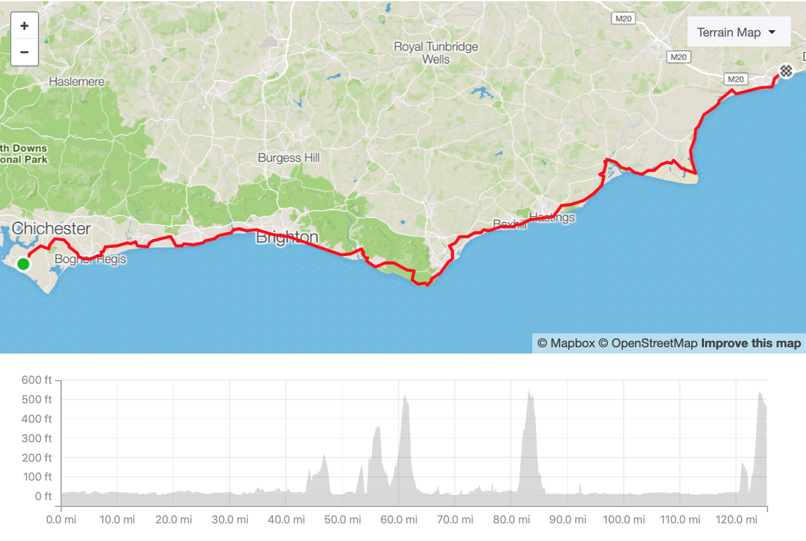

 * [What and why](#what-and-why)
 * [Preparations](#preparations)
 * [Travel](#travel)
   * [Depature](#depature)
   * [Day 1](#day-1)
   * [Day 2](#day-2)
   * [Day 3](#day-3)
   * [Day 4](#day-4)
   * [Day 5](#day-5)
   * [Recover](#recover)
   * [Back to the office](#back-to-the-office)
 * [Plan](#plan)
   * [Costs](#costs)
   * [Schedule](#schedule)

## What and why?

Another year, another challenge. After cycling 300 miles for University or Liverpool Pancreatic Cancer Research Fund in 2017 and walking over 50 miles for 11-year-old Szymon in 2018 I continue my journey by cycling 560 miles from Cornwall to Kent (and back to London).

While doing it I'll be [fundraising](https://www.justgiving.com/fundraising/cornwalltokent) for my local hospital children care units. The whole trip will be documented on Instagram and here. This article may also be updated a few times before the trip starts.

<just-giving></just-giving>

## Preparations

My bike will be tuned for a ride and is [fully insured](https://www.pedalsure.com/)
and registered in [BikeRegister](https://www.bikeregister.com/). I will have to
take proper locks of course and rain cover. I need still to decide if I'd take
paneer, but I may be fine with my large backpack. I will also take my small and
handy [Yellowstone Alpine 2](https://www.capitaloutdoors.co.uk/products/yellowstone-alpine-2-man-tent) tent.

Essentials like spare inner tubes, breaks blocks, first aid kit are obvious.

For the equipment, I'd have my two GoPro Session 4 cameras with
[extended 2000mAh batteries](https://www.amazon.co.uk/EcstaPro-Extended-Battery-Session-GP-KT5S/dp/B01MZE1OE1/) which should triple their use time. I'd use them more to document
the trip than as dashcam.

Food and water are essential, but I learned that it's best to have just around
1 litre of water (one in a holder and one in the backpack) and some muesli or
chocolate bars. For the rest having some Tesco Extra and McDonalds on the route
works best and value for money and convenience. Bars, pubs and restaurants are
too expensive - so I'd use them only for a kind meal, but except dinner on such
a trip, you can't eat too much at once.

## Trip overview

### Depature

I will leave the office earlier on 31st July to get to London Paddington station
and from there take a train (£38) to Penzance. I'd arrive there around 23:00 and
stay at [Ponsandane](http://www.ponsandane.co.uk/) camping site (£7.00).

<instagram-embed url="https://www.instagram.com/p/BxDYIf8AkIs/"></instagram-embed>

### Day 1

> 102 miles, 9158 feet gain, hilly, steep climbs

I'll leave in the morning west, to the Lands End (10m) where I can have some nice Cornish Pastry together with taking some pics. From there trip to Kent really starts.

<instagram-embed url="https://www.instagram.com/p/BsccqOinCqL/" hideCaption={true}></instagram-embed>

On 43rd mile, I can stop a while after climbing Carn Marth hill and take a look at the views and [amphitheatre](http://www.carnmarth.org.uk/).

<instagram-embed url="https://www.instagram.com/p/Bvuci9Sn4rf/" hideCaption={false}></instagram-embed>

Going downhill on the 52nd mile I'll arrive at river [Fal ferry](https://www.falriver.co.uk/getting-about/ferries/king-harry-ferry) (£1.00) landing  where I should be crossing its nice delta.

<instagram-embed url="https://www.instagram.com/p/Bsxh6wFn3uB/" hideCaption={false}></instagram-embed>

St. Austell (69th mile) would be a good place to restock and take a rest.

<instagram-embed url="https://www.instagram.com/p/BvqffxXF273/" hideCaption={false}></instagram-embed>

Another river on my way I'll cross with [Fower Bodnick Ferry](http://www.ctomsandson.co.uk/bodinnick-ferry/ferry-and-timetable/) (77th mile).

<instagram-embed url="https://www.instagram.com/p/BkFY-ubn6yW/" hideCaption={false}></instagram-embed>

Ten miles later (87th mile) I'll be crossing on the bridge in Looe.

<instagram-embed url="https://www.instagram.com/p/BxdUa5FALzH/" hideCaption={false}></instagram-embed>

Last "bigger" stop seems to be Seaton (91th mile) in Devon.

<instagram-embed url="https://www.instagram.com/p/BxUcG0jFibO/" hideCaption={false}></instagram-embed>

My day will end on the 102nd mile in the [Maker Camp](https://makercamp.org.uk) (£12.00).

<instagram-embed url="https://www.instagram.com/p/5UGlpqugaB/" hideCaption={false}></instagram-embed>

### Day 2

109 miles, 9356 feet gain

In the early morning, I'll use a Ceryll Ferry (£3.00) (https://www.plymouthboattrips.co.uk/ferries/cremyll-ferry/#tab28) to enter Plymouth.

<instagram-embed url="https://www.instagram.com/p/Bu1Phi-g3L6/" hideCaption={false}></instagram-embed>

I'll enter Dartmoor National Park in Yelverton (13th mile).

<instagram-embed url="https://www.instagram.com/p/BuOxmNGg-YL/" hideCaption={false}></instagram-embed>

Then plan a small break in Princetown (18th mile) on the first peak this day.

<instagram-embed url="https://www.instagram.com/p/BxGFoSllB3q/" hideCaption={false}></instagram-embed>

After that, I'd have to climb on another big one - Hookney Tor (27th mile).

<instagram-embed url="https://www.instagram.com/p/Bwt7CEPBqxg/" hideCaption={false}></instagram-embed>

Next bit of civilization I can expect in Moretonhamstread (32nd mile).

<instagram-embed url="https://www.instagram.com/p/BvWDTLNgPi0/" hideCaption={false}></instagram-embed>

On 45th mile I'll be in Exeter.

<instagram-embed url="https://www.instagram.com/p/BxfIws6HIAf/" hideCaption={false}></instagram-embed>

In Honiton (64th mile) I'll prepare for another climb.

<instagram-embed url="https://www.instagram.com/p/BnTdws_gEgn/" hideCaption={false}></instagram-embed>

To climb again in Axminster (75th mile).

<instagram-embed url="https://www.instagram.com/p/Bw_lRbJHlr-/" hideCaption={false}></instagram-embed>

I'll reach Bridport (90th mile).

<instagram-embed url="https://www.instagram.com/p/BgzB-ZgjXKw/" hideCaption={false}></instagram-embed>

And finally in Wyke Regis (108th mile) I'll stay at [Martleaves Farm Campsite](https://www.weymouthcampingandcaravanpark.co.uk/) (£12.00)

<instagram-embed url="https://www.instagram.com/p/Bp2IEStAktj/" hideCaption={false}></instagram-embed>

### Day 3

103 miles, 3886 feet gain

Weymouth (3m)

<instagram-embed url="https://www.instagram.com/p/BwU8kjYH1PY/" hideCaption={false}></instagram-embed>

25	Corfe Castle

<instagram-embed url="https://www.instagram.com/p/BxEkqpDBOTj/" hideCaption={false}></instagram-embed>

33	Shell Bay Terminal ferry 1gbp

37	Bournemouth

<instagram-embed url="https://www.instagram.com/p/BwfA42tFUaH/" hideCaption={false}></instagram-embed>

43	Christchurch

<instagram-embed url="https://www.instagram.com/p/Bw5BQ7KAJfd/" hideCaption={false}></instagram-embed>

58	Lyndhurst

<instagram-embed url="https://www.instagram.com/p/BxdSA-XH6_o/" hideCaption={false}></instagram-embed>

68	Southampton

<instagram-embed url="https://www.instagram.com/p/BxfI9BxF5sF/" hideCaption={false}></instagram-embed>

97	Chichester

<instagram-embed url="https://www.instagram.com/p/Bxer5UdBGPt/" hideCaption={false}></instagram-embed>

103		£14.00https://www.campsites.co.uk/search/campsites-in-sussex/bognor-regis/rowan-park-caravan-club-site

### Day 4

122 miles, 3380 feet gain

10	Bognor Regis

<instagram-embed url="https://www.instagram.com/p/Bat9r2bBWw-/" hideCaption={false}></instagram-embed>

38	Brighton

<instagram-embed url="https://www.instagram.com/p/BxfOR3cHb3r/" hideCaption={false}></instagram-embed>

51	Seaford

<instagram-embed url="https://www.instagram.com/p/Bwl6gOrlkFw/" hideCaption={false}></instagram-embed>

61	Eastbourne

<instagram-embed url="https://www.instagram.com/p/BwjDNThls1_/" hideCaption={false}></instagram-embed>

77	Hastings

<instagram-embed url="https://www.instagram.com/p/BxeH2uEl4pD/" hideCaption={false}></instagram-embed>

88	Rye

<instagram-embed url="https://www.instagram.com/p/BkdS-gChvHV/" hideCaption={false}></instagram-embed>

97	Lydd

<instagram-embed url="https://www.instagram.com/p/Br7ehuNDfYN/" hideCaption={false}></instagram-embed>

118	Folkestone

<instagram-embed url="https://www.instagram.com/p/BaXNrlBALn7/" hideCaption={false}></instagram-embed>

121	Little Satmar	£15.00

### Day 5

122 miles, 4412 feet gain

5	Dover

<instagram-embed url="https://www.instagram.com/p/BxKD3HDgAkB/" hideCaption={false}></instagram-embed>

29	Broadstairs

<instagram-embed url="https://www.instagram.com/p/BuQ2ZT0DuXz/" hideCaption={false}></instagram-embed>

35	Margate

<instagram-embed url="https://www.instagram.com/p/BxF34McFqvS/" hideCaption={false}></instagram-embed>

52	Withstable

<instagram-embed url="https://www.instagram.com/p/BmEy0OeAtPT/" hideCaption={false}></instagram-embed>

98	Dartford

<instagram-embed url="https://www.instagram.com/p/BxctnPXBWsr/" hideCaption={false}></instagram-embed>

121	Wimbledon Chase

<instagram-embed url="https://www.instagram.com/p/BwbNVHxBY4x/" hideCaption={false}></instagram-embed>

### Recover

One day only

### Back to the office

Fresh and ready

## Plan

### Schedule

| Date       | Time  | Milage | Location              | Description
| ---------- | ----- | -------| --------------------- | -----
| July 31st  | 18:03 | -      | London Paddington     | Train to Penzance
| July 31st  | 20:03 | -      | Penzance              | arrival, rest
| August 1st |       | 0      | Penzance              | depature
| August 1st |       | 13     | Lands End
| August 1st |       | 22     | Penzance
| August 1st |       | 43     | Carn Marth
| August 1st |       | 52     | River Fal Ferry
| August 1st |       | 69     | St. Austell
| August 1st |       | 77     | Fower Bodnick Ferry
| August 1st |       | 87     | Looe
| August 1st |       | 91     | Seaton
| August 1st |       | 100    | Millbrook
| August 1st |       | 102    | Maker Camp
| August 2nd |       | 0      | Maker Camp
| August 2nd |       | 2      | Ceryll Ferry
| August 2nd |       | 13     | Yelverton
| August 2nd |       | 18     | Princetown
| August 2nd |       | 27     | Hookney Tor
| August 2nd |       | 32     | Moretonhampstead
| August 2nd |       | 45     | Exeter
| August 2nd |       | 64     | Honiton
| August 2nd |       | 75     | Axmister
| August 2nd |       | 90     | Bridport
| August 2nd |       | 108    | Wyke Regis
| August 2nd |       | 109    | Marleaves Farm Campsite
| August 3nd |       | 0      | Marleaves Farm Campsite

### Costs

| Category        | Value  | Descripton |
| --------------- | ------ | ---------- |
| Transport         | £38      | GWR Ticket London Paddington to Penzance
| Transport         | £1       | Fal River Ferry
| Transport         | £2       | Fower Ferry
| Transport         | £3       | Ceryll Ferry
| Transport         | £1       | Shellbay Ferry
| **Transport**     | **£45**  | **Total**
| Accommodation     | £7       | Pasadene
| Accommodation     | £12      | Maker
| Accommodation     | £12      | Martleaves
| Accommodation     | £24      | Red House Farm
| Accommodation     | £15      | Little Satmar
| **Accommodation** | **£70**  | **Total**
| Equipment         | £        | Spare inner tubes
| Equipment         | £        | Spare break pads
| Equipment         | £        | First aid kit
| Equipment         | £        | Solar charger
| Equipment         | £        | Camera batteries
| **Equipment**     | **£**    | **Total**
| Food              | £
| Others            | £